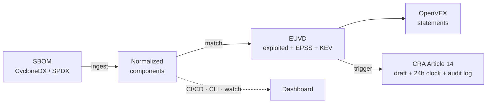

# euvd-watch

**EUVD-native software supply-chain vulnerability watch + EU Cyber Resilience Act (CRA) reporting toolkit.**

> ⚠️ **Status: work in progress.** APIs and structure may change until `1.0.0`.
> The Commands table below marks what is **✅ available today** versus **🧪 beta**
> versus **🚧 planned** — milestones M0–M5 (scan, match, VEX, the CRA workflow, `watch`
> mode, Docker image, GitHub Action, GitLab template, PyPI releases) are implemented
> and tested. The dashboard (M6) is implemented and usable today (`web serve`) but
> still **beta**: accessibility verification and a deployment guide land before its
> `1.1` GA.

`euvd-watch` connects software supply-chain transparency to **Europe's own vulnerability infrastructure** and to the concrete reporting duties of the **EU Cyber Resilience Act**.

It ingests your **SBOM**, continuously matches every component against the **European Union Vulnerability Database (EUVD)** operated by ENISA — including its *actively exploited* flag and EPSS scores — automatically drafts machine-readable **VEX** statements to cut false-positive noise, and, when a component is hit by an actively exploited vulnerability, **drafts the CRA Article 14 notification and starts the 24-hour clock** with a tamper-evident audit trail.

## Why this exists

SBOM generation (Syft, cdxgen) and scanning against US sources (NVD, OSV) are mature. But:

- **Nothing open is built around the EUVD** — Europe's own vulnerability database, operated by ENISA.
- **Nothing connects "exploited" status to the CRA's actual reporting workflow** (the 24-hour early warning to ENISA/CSIRTs).
- **VEX generation is still mostly manual**, so teams drown in non-applicable findings.

`euvd-watch` fills that gap as a **self-hostable building block** that runs in CI/CD and on a schedule. It does **not** reinvent SBOM generators or scanners — it reuses them.

## Pipeline



## Quickstart (everything below works today)

```bash
pip install euvd-watch
euvd-watch version

# 1. Generate an SBOM for your project (using Syft, or bring your own)
syft dir:. -o cyclonedx-json > sbom.cdx.json

# 2. See what's inside it
euvd-watch scan sbom.cdx.json

# 3. Match it against the EUVD — show only actively exploited vulnerabilities
euvd-watch match sbom.cdx.json --exploited-only

# 4. Generate OpenVEX statements (conservative by design)
euvd-watch vex generate sbom.cdx.json -o openvex.json

# 5. Check whether anything crossed your CRA reporting threshold
euvd-watch cra check sbom.cdx.json
euvd-watch cra status

# 6. Watch it on a schedule - notify only new/resolved/changed findings
euvd-watch watch sbom.cdx.json --interval 6h
```

## Commands

| Command | Status | What it does |
|---|---|---|
| `scan <sbom>` | ✅ | Parse and normalize a CycloneDX (1.4–1.6) / SPDX (2.3) **JSON** SBOM into a component inventory. |
| `match <sbom>` | ✅ | Match components against the EUVD, with confidence scoring and EPSS/KEV enrichment. Flags: `--exploited-only`, `--min-confidence`, `--fail-on`, `--no-enrich`, `--save-findings`, `--timestamp`. |
| `vex generate <sbom>` | ✅ | Draft OpenVEX statements. Only provably safe findings become `not_affected`; everything uncertain stays `under_investigation`. Merges your `vex-decisions.yaml` (`--fail-on-conflict` for CI). |
| `vex init-decisions <sbom>` | ✅ | Scaffold a `vex-decisions.yaml` from current findings for humans to fill in. |
| `cra check <sbom>` | ✅ | Evaluate the configurable reporting trigger (EUVD exploited / CISA KEV / EPSS threshold) and open events. Exit 1 when a **new** event opens. |
| `cra status` / `cra draft <id>` / `cra mark <id>` | ✅ | Track the staged deadline clocks (24 h / 72 h / final report), render a prefilled notification draft with `TODO-HUMAN` markers, record human completion. |
| `cra verify-log` | ✅ | Verify the tamper-evident (hash-chained) audit log; names the first broken entry. |
| `watch <sbom>` | ✅ | Re-match on a schedule (`--interval 6h`) or once (`--once`, the default) and notify **only new/resolved/changed findings** (stdout, and `--webhook URL`). See `docs/watch.md`. |
| `db migrate` | ✅ | Apply pending schema migrations to the consolidated state DB (`state_dir/euvd-watch.sqlite`) and import pre-0.4 state files. Runs transparently on every state-touching command; this makes it explicit. See `docs/storage.md`. |
| `web serve` | 🧪 beta (`1.1` target) | Self-hostable dashboard: findings, VEX statuses, CRA countdowns, audit log, one password-gated write action. `web hash-password` sets the credential. Accessibility (WCAG 2.1 AA) verification and a deployment guide are still open — see `docs/web.md`. |

All implemented commands support `--output json|table` and CI-friendly exit codes
(`0` clean, `1` findings, `2` error). Unimplemented commands exit `2` with a clear message.

## Using it in CI

The GitHub Action (`action.yml` at the repo root), the GitLab include-template
(`templates/euvd-watch.gitlab-ci.yml`) and the Docker image (`docker/Dockerfile`) are
implemented, schema-linted, and dogfooded by this repository's own CI — see
`docs/integrations.md` for the full reference.

GitHub Actions:

```yaml
- uses: anchore/sbom-action@v0          # generate SBOM with Syft
  with: { format: cyclonedx-json, output-file: sbom.cdx.json }
- uses: caisarus/euvd@v0.3.1
  with:
    sbom-path: sbom.cdx.json
    fail-on: exploited
```

GitLab CI:

```yaml
include:
  - remote: 'https://raw.githubusercontent.com/caisarus/euvd/main/templates/euvd-watch.gitlab-ci.yml'

euvd-watch:
  variables: { EUVDWATCH_SBOM: "sbom.cdx.json", EUVDWATCH_FAIL_ON: "exploited" }
```

Docker (`ghcr.io/caisarus/euvd-watch`, or build locally):

```bash
docker run --rm -v "$PWD:/work:ro" ghcr.io/caisarus/euvd-watch:latest match /work/sbom.cdx.json
# or build from a clone:
docker build -f docker/Dockerfile -t euvd-watch .
```

## Configuration

`euvd-watch.yaml` (or `--config`, or `EUVD_WATCH_*` env vars):

```yaml
cache_dir: ~/.cache/euvd-watch
epss_threshold: 0.5
min_confidence: medium
organization:
  name: "Example S.R.L."
  contact_email: security@example.com
  product_name: "Example Product"
cra_trigger:
  euvd_exploited: true
  cisa_kev: true
  epss_over_threshold: true
```

## Design principles

- **Reuse, don't reinvent** — wrap Syft/cdxgen output, OpenVEX, EPSS, KEV; build only the missing glue.
- **EUVD-first**, with OSV/KEV/EPSS as supplements.
- **Conservative VEX** — never auto-suppress something that might be real risk.
- **Human-in-the-loop reporting** — `euvd-watch` drafts; a human confirms before anything is filed. The tool never submits anything automatically.
- **Auditable** — every decision carries a human-readable explanation and lands in a hash-chained audit log.
- **Deterministic** — same inputs produce byte-identical outputs.

## What euvd-watch is NOT

- Not an SBOM generator (use Syft/cdxgen).
- Not a general-purpose scanner replacement (Grype/Trivy remain great for NVD/OSV coverage).
- Not legal advice, and not an automatic filing tool — CRA notifications are always reviewed and submitted by a human through official channels.

## Architecture & docs

- [docs/matching.md](docs/matching.md) — matching strategies & confidence scoring
- [docs/cra.md](docs/cra.md) — the CRA Article 14 workflow, deadline stages, and the
  audit log's honest threat model
- [docs/euvd-api.md](docs/euvd-api.md) — the verified EUVD API surface this tool uses
- [README.simple.md](README.simple.md) — the same story, explained so a child can follow it
- [GLOSSARY.md](GLOSSARY.md) — every technical term (SBOM, VEX, CRA, EPSS…) explained in plain language
- 🚧 coming with their milestones: `ARCHITECTURE.md`, `docs/deploy.md` (self-hosting),
  `CONTRIBUTING.md`

## Contributing

Early contributors very welcome — `CONTRIBUTING.md` is coming; until then, open an issue.

## License

[EUPL-1.2](LICENSE). Documentation provided in English and Romanian —
see [README.ro.md](README.ro.md) / vezi [README.ro.md](README.ro.md).
