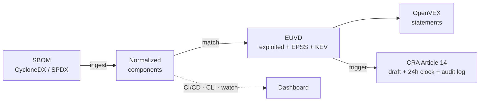

# euvd-watch

**EUVD-native software supply-chain vulnerability watch + EU Cyber Resilience Act (CRA) reporting toolkit.**

> ⚠️ **Status: work in progress.** APIs and structure may change until `1.0.0`.
> The Commands table below marks what is **✅ available today** versus **🚧 planned** —
> milestones M0–M3 (scan, match, VEX) are implemented and tested; the CRA workflow (M4)
> is being built now; watch/CI templates (M5) come next. The dashboard ships in `1.1`.

`euvd-watch` connects software supply-chain transparency to **Europe's own vulnerability infrastructure** and to the concrete reporting duties of the **EU Cyber Resilience Act**.

It ingests your **SBOM**, continuously matches every component against the **European Union Vulnerability Database (EUVD)** operated by ENISA — including its *actively exploited* flag and EPSS scores — automatically drafts machine-readable **VEX** statements to cut false-positive noise, and, when a component is hit by an actively exploited vulnerability, **drafts the CRA Article 14 notification and starts the 24-hour clock** with a tamper-evident audit trail.

## Why this exists

SBOM generation (Syft, cdxgen) and scanning against US sources (NVD, OSV) are mature. But:

- **Nothing open is built around the EUVD** — Europe's own vulnerability database, operated by ENISA.
- **Nothing connects "exploited" status to the CRA's actual reporting workflow** (the 24-hour early warning to ENISA/CSIRTs).
- **VEX generation is still mostly manual**, so teams drown in non-applicable findings.

`euvd-watch` fills that gap as a **self-hostable building block** that runs in CI/CD and on a schedule. It does **not** reinvent SBOM generators or scanners — it reuses them.

## Pipeline



## Quickstart (everything below works today)

```bash
# Not yet on PyPI - install from a clone until the first release:
pip install -e .
euvd-watch version

# 1. Generate an SBOM for your project (using Syft, or bring your own)
syft dir:. -o cyclonedx-json > sbom.cdx.json

# 2. See what's inside it
euvd-watch scan sbom.cdx.json

# 3. Match it against the EUVD — show only actively exploited vulnerabilities
euvd-watch match sbom.cdx.json --exploited-only

# 4. Generate OpenVEX statements (conservative by design)
euvd-watch vex generate sbom.cdx.json -o openvex.json
```

Coming with the CRA milestone (in progress):

```bash
euvd-watch cra check sbom.cdx.json
euvd-watch cra status
```

## Commands

| Command | Status | What it does |
|---|---|---|
| `scan <sbom>` | ✅ | Parse and normalize a CycloneDX (1.4–1.6) / SPDX (2.3) **JSON** SBOM into a component inventory. |
| `match <sbom>` | ✅ | Match components against the EUVD, with confidence scoring and EPSS/KEV enrichment. Flags: `--exploited-only`, `--min-confidence`, `--fail-on`, `--no-enrich`, `--save-findings`, `--timestamp`. |
| `vex generate <sbom>` | ✅ | Draft OpenVEX statements. Only provably safe findings become `not_affected`; everything uncertain stays `under_investigation`. Merges your `vex-decisions.yaml` (`--fail-on-conflict` for CI). |
| `vex init-decisions <sbom>` | ✅ | Scaffold a `vex-decisions.yaml` from current findings for humans to fill in. |
| `cra check <sbom>` | 🚧 M4 (in progress) | Evaluate the configurable reporting trigger (EUVD exploited / CISA KEV / EPSS threshold) and open events. |
| `cra status` / `cra draft <id>` / `cra mark <id>` | 🚧 M4 (in progress) | Track 24 h clocks, render a prefilled notification draft, record human completion. |
| `cra verify-log` | 🚧 M4 (in progress) | Verify the tamper-evident (hash-chained) audit log. |
| `watch <sbom>` | 🚧 M5 (planned) | Re-match on a schedule and notify **only about new or changed findings** (stdout / webhook). |
| `web serve` | 🚧 post-1.0 (planned for `1.1`) | Self-hostable, WCAG-compliant dashboard: findings, VEX statuses, CRA countdowns, audit log. |

All implemented commands support `--output json|table` and CI-friendly exit codes
(`0` clean, `1` findings, `2` error). Unimplemented commands exit `2` with a clear message.

## Using it in CI (🚧 planned — M5)

The ready-made GitHub Action and GitLab CI include-template ship with milestone M5.
Until then, `pip install` + `euvd-watch match --fail-on exploited` works in any CI job.
The planned copy-paste snippets:

GitHub Actions:

```yaml
- uses: anchore/sbom-action@v0          # generate SBOM with Syft
  with: { format: cyclonedx-json, output-file: sbom.cdx.json }
- uses: <org>/euvd-watch-action@v1      # 🚧 not published yet
  with:
    sbom-path: sbom.cdx.json
    fail-on: exploited
```

GitLab CI:

```yaml
include:  # 🚧 template not published yet
  - remote: 'https://raw.githubusercontent.com/<org>/euvd-watch/main/templates/euvd-watch.gitlab-ci.yml'
```

## Configuration

`euvd-watch.yaml` (or `--config`, or `EUVD_WATCH_*` env vars):

```yaml
cache_dir: ~/.cache/euvd-watch
epss_threshold: 0.5
min_confidence: medium
organization:
  name: "Example S.R.L."
  contact_email: security@example.com
  product_name: "Example Product"
cra_trigger:
  euvd_exploited: true
  cisa_kev: true
  epss_over_threshold: true
```

## Design principles

- **Reuse, don't reinvent** — wrap Syft/cdxgen output, OpenVEX, EPSS, KEV; build only the missing glue.
- **EUVD-first**, with OSV/KEV/EPSS as supplements.
- **Conservative VEX** — never auto-suppress something that might be real risk.
- **Human-in-the-loop reporting** — `euvd-watch` drafts; a human confirms before anything is filed. The tool never submits anything automatically.
- **Auditable** — every decision carries a human-readable explanation and lands in a hash-chained audit log.
- **Deterministic** — same inputs produce byte-identical outputs.

## What euvd-watch is NOT

- Not an SBOM generator (use Syft/cdxgen).
- Not a general-purpose scanner replacement (Grype/Trivy remain great for NVD/OSV coverage).
- Not legal advice, and not an automatic filing tool — CRA notifications are always reviewed and submitted by a human through official channels.

## Architecture & docs

- [docs/matching.md](docs/matching.md) — matching strategies & confidence scoring
- [docs/euvd-api.md](docs/euvd-api.md) — the verified EUVD API surface this tool uses
- [README.simple.md](README.simple.md) — the same story, explained so a child can follow it
- [GLOSSARY.md](GLOSSARY.md) — every technical term (SBOM, VEX, CRA, EPSS…) explained in plain language
- 🚧 coming with their milestones: `ARCHITECTURE.md`, `docs/cra.md` (CRA Article 14
  workflow), `docs/deploy.md` (self-hosting), `CONTRIBUTING.md`

## Contributing

Early contributors very welcome — `CONTRIBUTING.md` is coming; until then, open an issue.

## License

[EUPL-1.2](LICENSE). Documentation provided in English and Romanian —
see [README.ro.md](README.ro.md) / vezi [README.ro.md](README.ro.md).
