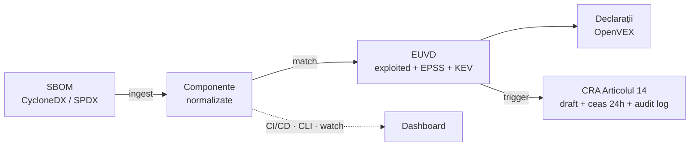

# euvd-watch

**Toolkit nativ EUVD pentru supravegherea vulnerabilităților din lanțul de aprovizionare software + raportare conform EU Cyber Resilience Act (CRA).**

> ⚠️ **Status: în lucru.** API-urile și structura se pot schimba până la `1.0.0`.
> Tabelul de comenzi de mai jos marchează ce este **✅ disponibil azi** față de **🚧
> planificat** — milestone-urile M0–M4 (scan, match, VEX, fluxul CRA) sunt implementate
> și testate; watch și template-urile CI (M5) urmează. Dashboard-ul apare în `1.1`.
>
> *Această traducere urmează [README-ul în engleză](README.md); în caz de divergență,
> versiunea engleză este cea de referință.*

`euvd-watch` conectează transparența lanțului de aprovizionare software la **infrastructura
europeană de vulnerabilități** și la obligațiile concrete de raportare din **EU Cyber
Resilience Act**.

Ingerează **SBOM-ul** tău, corelează continuu fiecare componentă cu **European Union
Vulnerability Database (EUVD)** operată de ENISA — inclusiv marcajul *actively exploited*
și scorurile EPSS — redactează automat declarații **VEX** machine-readable pentru a reduce
zgomotul de false-positive-uri, iar când o componentă este lovită de o vulnerabilitate
exploatată activ, **redactează draftul notificării CRA Articolul 14 și pornește ceasul de
24 de ore**, cu un jurnal de audit tamper-evident.

## De ce există

Generarea SBOM (Syft, cdxgen) și scanarea contra surselor americane (NVD, OSV) sunt mature. Dar:

- **Nimic open-source nu e construit în jurul EUVD** — baza de date europeană de vulnerabilități, operată de ENISA.
- **Nimic nu leagă statusul „exploited" de fluxul real de raportare CRA** (avertizarea timpurie de 24 h către ENISA/CSIRT-uri).
- **Generarea VEX e încă în mare parte manuală**, așa că echipele se îneacă în finding-uri neaplicabile.

`euvd-watch` umple acest gol ca **piesă self-hostable** care rulează în CI/CD și programat.
**Nu** reinventează generatoarele de SBOM sau scanerele — le refolosește.

## Pipeline



## Pornire rapidă (tot ce e mai jos funcționează azi)

```bash
# Încă nu e pe PyPI - instalează dintr-o clonă până la prima lansare:
pip install -e .
euvd-watch version

# 1. Generează un SBOM pentru proiectul tău (cu Syft, sau adu-l pe al tău)
syft dir:. -o cyclonedx-json > sbom.cdx.json

# 2. Vezi ce conține
euvd-watch scan sbom.cdx.json

# 3. Corelează-l cu EUVD — arată doar vulnerabilitățile exploatate activ
euvd-watch match sbom.cdx.json --exploited-only

# 4. Generează declarații OpenVEX (conservatoare prin design)
euvd-watch vex generate sbom.cdx.json -o openvex.json

# 5. Verifică dacă ceva a depășit pragul tău de raportare CRA
euvd-watch cra check sbom.cdx.json
euvd-watch cra status
```

## Comenzi

| Comandă | Status | Ce face |
|---|---|---|
| `scan <sbom>` | ✅ | Parsează și normalizează un SBOM **JSON** CycloneDX (1.4–1.6) / SPDX (2.3) într-un inventar de componente. |
| `match <sbom>` | ✅ | Corelează componentele cu EUVD, cu scor de încredere și îmbogățire EPSS/KEV. Flag-uri: `--exploited-only`, `--min-confidence`, `--fail-on`, `--no-enrich`, `--save-findings`, `--timestamp`. |
| `vex generate <sbom>` | ✅ | Redactează declarații OpenVEX. Doar finding-urile probabil sigure devin `not_affected`; tot ce e incert rămâne `under_investigation`. Îmbină `vex-decisions.yaml` (`--fail-on-conflict` pentru CI). |
| `vex init-decisions <sbom>` | ✅ | Generează scheletul unui `vex-decisions.yaml` din finding-urile curente, pentru completare umană. |
| `cra check <sbom>` | ✅ | Evaluează trigger-ul configurabil de raportare (EUVD exploited / CISA KEV / prag EPSS) și deschide evenimente. Iese cu 1 când se deschide un eveniment **nou**. |
| `cra status` / `cra draft <id>` / `cra mark <id>` | ✅ | Urmărește ceasurile pe stagii (24 h / 72 h / raport final), redă un draft de notificare precompletat cu marcaje `TODO-HUMAN`, înregistrează finalizarea umană. |
| `cra verify-log` | ✅ | Verifică jurnalul de audit tamper-evident (hash-chained); numește prima intrare ruptă. |
| `watch <sbom>` | 🚧 M5 (planificat) | Re-corelează programat și notifică **doar despre finding-uri noi sau schimbate** (stdout / webhook). |
| `web serve` | 🚧 post-1.0 (planificat pentru `1.1`) | Dashboard self-hostable, conform WCAG: finding-uri, statusuri VEX, countdown-uri CRA, audit log. |

Toate comenzile implementate suportă `--output json|table` și coduri de ieșire prietenoase
cu CI (`0` curat, `1` finding-uri, `2` eroare). Comenzile neimplementate ies cu `2` și un
mesaj clar.

## Folosire în CI (🚧 planificat — M5)

GitHub Action-ul gata făcut și template-ul include pentru GitLab CI vin cu milestone-ul M5.
Până atunci, `pip install` + `euvd-watch match --fail-on exploited` funcționează în orice
job de CI. Snippet-urile plănuite:

GitHub Actions:

```yaml
- uses: anchore/sbom-action@v0          # generează SBOM cu Syft
  with: { format: cyclonedx-json, output-file: sbom.cdx.json }
- uses: <org>/euvd-watch-action@v1      # 🚧 încă nepublicat
  with:
    sbom-path: sbom.cdx.json
    fail-on: exploited
```

GitLab CI:

```yaml
include:  # 🚧 template încă nepublicat
  - remote: 'https://raw.githubusercontent.com/<org>/euvd-watch/main/templates/euvd-watch.gitlab-ci.yml'
```

## Configurare

`euvd-watch.yaml` (sau `--config`, sau variabile de mediu `EUVD_WATCH_*`):

```yaml
cache_dir: ~/.cache/euvd-watch
epss_threshold: 0.5
min_confidence: medium
organization:
  name: "Example S.R.L."
  contact_email: security@example.com
  product_name: "Example Product"
cra_trigger:
  euvd_exploited: true
  cisa_kev: true
  epss_over_threshold: true
```

## Principii de design

- **Refolosește, nu reinventa** — împachetează output-ul Syft/cdxgen, OpenVEX, EPSS, KEV; construiește doar liantul lipsă.
- **EUVD pe primul loc**, cu OSV/KEV/EPSS ca suplimente.
- **VEX conservator** — nu suprima automat niciodată ceva ce ar putea fi risc real.
- **Raportare cu omul în buclă** — `euvd-watch` redactează; un om confirmă înainte ca orice să fie depus. Tool-ul nu trimite nimic automat, niciodată.
- **Auditabil** — fiecare decizie poartă o explicație pe înțelesul oamenilor și ajunge într-un jurnal de audit hash-chained.
- **Determinist** — aceleași intrări produc ieșiri identice byte-cu-byte.

## Ce NU este euvd-watch

- Nu e generator de SBOM (folosește Syft/cdxgen).
- Nu înlocuiește un scaner general (Grype/Trivy rămân excelente pentru acoperirea NVD/OSV).
- Nu e consultanță juridică și nu e un instrument de depunere automată — notificările CRA
  sunt întotdeauna verificate și transmise de un om, prin canalele oficiale.

## Arhitectură & documentație

- [docs/matching.md](docs/matching.md) — strategii de matching & scor de încredere *(engleză)*
- [docs/cra.md](docs/cra.md) — fluxul CRA Articolul 14, stagiile de termene și modelul
  onest de amenințări al jurnalului de audit *(engleză)*
- [docs/euvd-api.md](docs/euvd-api.md) — suprafața API EUVD verificată pe care o folosește tool-ul *(engleză)*
- [README.simple.md](README.simple.md) — aceeași poveste, explicată pe înțelesul unui copil *(engleză)*
- [GLOSSARY.md](GLOSSARY.md) — fiecare termen tehnic (SBOM, VEX, CRA, EPSS…) explicat simplu *(engleză)*
- 🚧 vin odată cu milestone-urile lor: `ARCHITECTURE.md`, `docs/deploy.md`
  (self-hosting), `CONTRIBUTING.md`

## Contribuții

Contributorii timpurii sunt foarte bineveniți — `CONTRIBUTING.md` e pe drum; până atunci,
deschide un issue.

## Licență

[EUPL-1.2](LICENSE). Documentație în engleză și română — versiunea de referință este
[README.md](README.md) (engleză).
